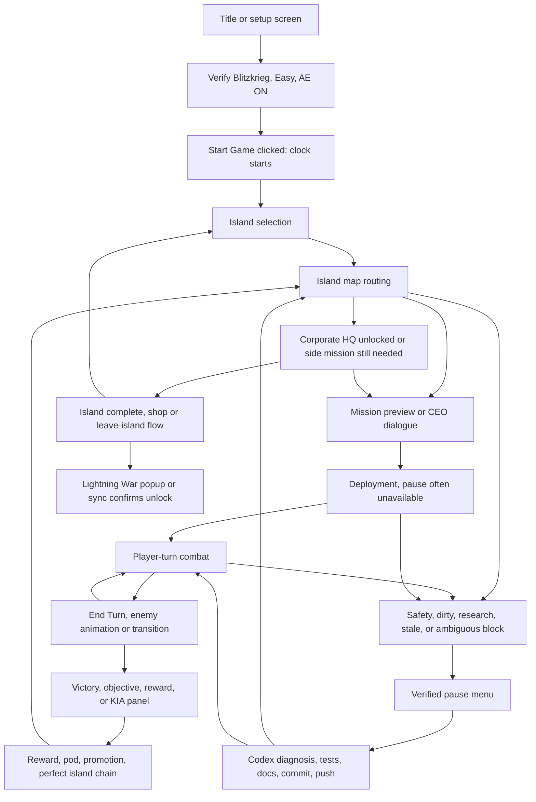

# Lightning War Flowchart

This document is the fast state-machine reference for Blitzkrieg Lightning War.
The Python conductor is the real-time player. Codex and the user are slow
planners and may be consulted only from verified pause or proven non-live states.

Authoritative timer source: save/profile `current.time` in milliseconds, with
visible pause-menu Timeline Playtime as corroborating evidence when available.
Do not use the generic profile `timer` field.

## State Table

| State | Detect | Clock | Pause | Codex/User | Fastest action | Fallback | Abandon/restart |
| --- | --- | --- | --- | --- | --- | --- | --- |
| Title/setup screen | Setup UI, no active run, verifier screenshot focused on ITB | Not started | Not required | Allowed | Sync achievements, verify Blitzkrieg/Easy/AE | Refocus game and re-verify | Wrong squad/difficulty/AE that cannot be fixed quickly |
| Start Game pressed | Start button accepted, transition to CEO/island select | Ticking from click | Maybe unavailable | Not allowed | Continue deterministic island-select flow | Pause as soon as gear is verified | Wrong setup discovered after start |
| Island selection | Four corporation cards, no mission map | Ticking | Maybe available | Only if verified pause | Prefer Archive, then R.S.T. when route supports it | Use `island_select.py --lightning-war` evidence | Bad first island slate if no fast route |
| Island map mission routing | Visible red regions or bridge island map | Ticking unless pause verified | Usually available | Only in pause | `recommend_mission --routing lightning_war`, then `lightning_segment` route start | `lightning_peek` from pause, then `lightning_map_regions` | No fast route and timer budget poor |
| Mission preview click-swallow risk | Yellow preview board or CEO dialogue over map | Ticking | Maybe available | Only in pause | Use Lightning route-start helpers and known start modes | Close/dismiss with calibrated helper, pause, reclassify | Wrong high-friction mission starts and deployment not yet accepted |
| Mission start confirmation | Preview board start committed | Ticking | Often unavailable | Not allowed | Let `lightning_segment` push into deployment | Use start-visible/dialogue helper once | Stuck preview with no verified pause and no deterministic commit |
| Deployment | Deployment zones visible, turn 0, fewer than 3 mechs placed | Ticking | Often unavailable | Not allowed | `lightning_segment` or deployment helper completes placement and CONFIRM | Calibrated deploy slots plus ranked tiles | Stale/uncertain placement that cannot be verified |
| Partial deployment or stale phase | Bridge says enemy/unknown but zones or missing mechs are visible | Ticking | Often unavailable | Not allowed | Continue deployment helper; skip already placed mechs | Fresh read after confirm only if bounded | Mech placement uncertainty after confirm |
| Player-turn combat | `phase == combat_player` and active mechs > 0 | Ticking unless paused | Available through guard | Not while live | `lightning_loop` / `auto_turn` with bridge verification | Pause before solve if configured, resume to execute | Research/desync/safety gate, mech HP/status loss |
| Enemy turn or animation | Phase enemy, active mechs 0, transition banners | Ticking | Usually unavailable | Not allowed | Let conductor wait/retry into player turn or terminal panel | Pause guard when safe UI appears | Stale bridge after timeout |
| Post-combat victory/objective | Region Secured, objectives, reward panel | Ticking | Usually available after panel | Only after pause | Clear safe panels, then pause | `lightning_ui handle_screen` or exact Continue | KIA, Timeline Lost, failed primary objective |
| Pilot/rescue/reward screens | Promotion, rescue, reward, pod, perfect panels | Ticking | Usually available after panel | Only after pause | Clear deterministic panels, take Grid for perfect reward | Pause after chain, then inspect | Terminal contradiction or unknown reward UI |
| Perfect island reward | Perfect reward picker | Ticking | Panel blocks pause | Not allowed | Pick Grid unless full grid/shop plan says otherwise | Clear to shop/map, then pause | None unless panel classifier is uncertain |
| Shop | Shop UI after island complete | Ticking unless pause verified | Usually available | Only in pause | Buy Grid Power to full, then leave quickly | Buy trivial core only if deterministic | Low grid and no reputation, timer poor |
| Island transition | Leave island, CEO intro, second island select | Ticking | Maybe available | Only in pause | Calibrated leave/confirm/select sequence | Pause after map/selection appears | First island complete too late |
| HQ/unlock detection | HQ preview active or No Vek Detected | Ticking | Usually available | Only in pause | Start HQ if active; otherwise fastest side mission | Inspect preview from pause | HQ unavailable and remaining slate too slow |
| Achievement popup | Steam/in-game popup or sync unlocked list | Ticking may continue | Stop as soon as safe | Allowed after pause/non-live | Record success and stop | Sync/restart Steam only if cache lags | Do not rerun unless evidence says locked |
| Pause menu verified | Classifier sees pause menu or timer stability confirms stop | Paused | Yes | Allowed | Think, diagnose, test, commit, push | Use `lightning_peek` for bounded evidence | None |
| Pause gear unavailable | Deployment/combat animation/nonpauseable UI | Ticking | No | Not allowed | Continue deterministic conductor action | Watch for next pauseable UI | If deterministic path is exhausted |
| Ambiguous UI classification | `island_map_or_unknown`, classifier error, focus lost | Unknown or ticking | Unknown | Only after verified pause | Pause guard once if eligible | Bounded `lightning_peek` only from pause | Repeated ambiguity while timer advances |
| Stale bridge/desync | Screen contradicts bridge or verify mismatch | Ticking unless paused | Seek pause | Only after pause | Stop live actions, park, diagnose | Fresh read plus screenshot from pause | Board uncertain, desync unresolved |
| Focus lost/window covered | Screenshot not Into the Breach or no window | Unknown | Unknown | Not until safe | Refocus ITB, screenshot, pause if possible | Stop if unable to refocus | Timer advancing while focus unavailable |
| Steam popup/overlay | Achievement or overlay appears | Unknown | Maybe blocks pause | Allowed only after safe | Capture evidence, then pause/sync | Restart/sync later if offline | Do not retarget on cache lag alone |
| Safety gate block | `RESEARCH_REQUIRED`, `INVESTIGATE`, `THREAT_AUDIT_BLOCKED`, post-enemy block | Ticking unless paused | Required before review | Allowed only after pause | Snapshot/diagnose/resolve per safety gates | Abandon if unsafe and no deterministic route | Unknown loss, timeline collapse, mech loss |
| Dirty-plan review block | Safety frontier has exact dirty consent id | Ticking unless paused | Required for Codex review | Only after pause | Use pre-approved Lightning speed policy or exact token | Pause, inspect frontier, rerun exact consent | Mech HP/status, unknown loss, grid <= 0 |
| Restart/abandon decision | Bad slate, timer poor, terminal result, wrong setup | Safe only after pause/title | Required | Allowed | Abandon/restart from safe state | Sync/capture evidence first | No island by 20 min or timer near 30 min |

The JSON companion table is `docs/agent/lightning-war-state-table.json`.
