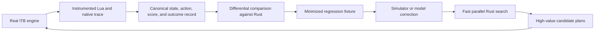

# ITB Engine Observatory: Looking Inside the Black Box

## Executive conclusion

Looking inside the real Into the Breach implementation is probably the
highest-leverage direction available for improving solver fidelity.

The important discovery is that ITB is not one sealed black box. The installed
game contains a large readable Lua specification surrounding a much smaller
native engine. The Lua already exposes weapon effects, targeting areas, spawn
selection, mission logic, and much of enemy target scoring. The remaining
unknowns are narrower and more valuable: native pathfinding, enemy movement and
tie-breaking, turn orchestration, random-number generation and consumption
order, effect execution, and hidden engine state.

The strategic ordering should therefore be:

1. Improve model fidelity by reading and instrumenting the real game.
2. Convert every discovery into Rust conformance tests and regression fixtures.
3. Use the real game as a slow authoritative oracle.
4. Use the Rust simulator as the fast search engine.
5. Scale trusted experiments and rollouts across cores, processes, and VMs.

Parallelizing an inaccurate simulator generates confident mistakes faster.
Improving fidelity first makes every later rollout and every VM worker more
valuable.

## Evidence from the installed Windows build

The locally installed Steam build was inspected read-only on 2026-07-16. Its
game directory contained:

- 153 `.lua` files totaling approximately 37,000 lines and 1.28 MB.
- 376 `.map` files.
- A 5,530,112-byte `Breach.exe`.
- A separate `lua5.1.dll`.
- Separate SDL2, OpenGL, FMOD, and Steam libraries.

The executable is 32-bit x86 and imports the Lua 5.1 C API directly, including
functions such as `lua_pushcclosure`, `lua_setfield`, `lua_pcall`, and
`luaL_loadfile`. Readable strings in the executable include:

- `random_int`
- `random_bool`
- `seed`
- `aiSeed`
- `death_seed`
- `ScorePositioning`
- `GetTargetScore`

Its debug directory retains the original PDB build path:

```text
D:\bigbrother\Kaiju\bin\Breach.pdb
```

The PDB itself is not installed, so a decompiler will not magically recover
the original source names. The path does, however, confirm that the executable
was built with debug-symbol metadata and gives us a useful fingerprint for the
native target.

The executable inspected during this snapshot had SHA-256:

```text
31FE352655982398FB3EE8B0BBE80EFD5D65E3A9AA11E3DC39D0364354493FE9
```

Any native offsets, signatures, or behavioral conclusions should be pinned to
an executable hash or exact game version. Memory layouts may change between
builds.

## What is already open in Lua

The shipped Lua is already an executable game specification for a surprisingly
large portion of the mechanics.

### Spawn selection

`scripts/spawner_backend.lua` contains `Spawner:NextPawn`, including:

- Weak-versus-strong selection ratios.
- Alpha upgrade ratios and streak breaking.
- Per-type maximum counts.
- Difficulty-dependent starting-spawn behavior.
- Living-upgrade caps.
- Leader/boss promotion.
- Pawn count tracking.
- Calls to `random_int`, `random_bool`, and `random_element` at the exact
  semantic decision points.

`scripts/spawner.lua` contains the difficulty- and island-specific spawner
parameters.

The spawn algorithm is therefore not fundamentally unknown. The unresolved
pieces are the native RNG implementation, its state, and the complete call
order leading into these Lua decisions.

### Enemy targeting

`scripts/global.lua` contains the default implementations of:

- `Skill:GetTargetArea`
- `Skill:GetTargetScore`
- `Skill:ScoreList`
- `ScorePositioning`

The scoring code explicitly handles queued and instant effects, friendly
damage, buildings, enemies, pods, movement position, smoke, fire, water,
spawning tiles, and custom pawn position scores. Enemy-specific weapon scripts
override `GetTargetScore` where they require custom behavior.

This means the visible target-scoring formula is already available. The main
unknowns are likely candidate generation, movement/path enumeration, native
position helpers, tie-breaking, and orchestration around those Lua callbacks.

### Weapons, missions, and environments

The Lua tree also contains:

- Player and enemy `GetSkillEffect` implementations.
- Target-area and two-click targeting logic.
- Advanced Edition weapons and enemies.
- Boss-specific behaviors.
- Mission-specific objectives and scripted units.
- Environment selection and effects.
- Island, drop, event, and campaign-generation rules.

The modding community explicitly recommends searching the shipped scripts,
probing native function signatures through the Lua console, and logging runtime
values to learn how ITB behaves:

- [How to learn - How to mod ITB](https://www.subsetgames.com/forum/viewtopic.php?f=26&t=35229)
- [ITB Mod Loader](https://github.com/itb-community/ITB-ModLoader)
- [Mostly complete public-function inventory extracted from the binary](https://gist.github.com/KnightMiner/2f308a3747461748d6a2186d823e3424)

## Why this matters to the current solver

Two current limitations line up directly with the remaining native unknowns.

### Enemy projection

The current depth-2 projection documents only about one-third agreement with
real enemy targeting. Observing the engine's candidate scores and final choices
could replace a broad learned approximation with a mostly exact algorithm plus
a much smaller residual model.

### Spawn replay

The seed-replay experiment showed that `master_seed` and `ai_seed` were not
enough to reproduce observed spawn outcomes. The blocker was not the Lua spawn
policy; it was the native `random_int`/`random_bool` behavior and hidden call
order. Runtime RNG tracing attacks that blocker directly.

Related local research:

- [`docs/seed_replay_experiment.md`](seed_replay_experiment.md)
- [`docs/seed_replay_hypotheses.md`](seed_replay_hypotheses.md)
- [`docs/parallel_universe_self_learning_research.md`](parallel_universe_self_learning_research.md)

## Recommended inside-out research ladder

| Layer | Method | Expected value | Difficulty |
|---|---|---:|---:|
| Shipped Lua | Index mechanics and map them to Rust | Extremely high | Low |
| Lua instrumentation | Log scores, candidates, effects, and RNG calls | Extremely high | Low-medium |
| Memory/API extension | Expose hidden board, pawn, and phase fields | High | Medium |
| Targeted native analysis | Analyze only unresolved native functions | High | Medium-high |
| Full engine reconstruction | Recreate the entire executable | Low ROI | Very high |

The goal is not to reconstruct rendering, audio, UI, or the entire campaign
engine. The solver needs an exact transition model, an accurate adversary model,
and well-calibrated uncertainty about future events.

## Phase 1: Treat Lua as an executable specification

Create a mechanics provenance index with entries such as:

```text
ITB Lua function
    -> corresponding Rust implementation
    -> focused conformance tests
    -> known differences or unsupported cases
    -> evidence source and engine build
```

Initial high-value mappings should include:

- Every player and enemy `GetSkillEffect`.
- Every `GetTargetArea` and `GetSecondTargetArea`.
- Every custom `GetTargetScore`.
- `Skill:ScoreList` and `ScorePositioning`.
- `Spawner:NextPawn` and `Spawner:SelectPawn`.
- Mission environment and turn-order callbacks.
- Advanced Edition overrides.

This index prevents mechanics knowledge from remaining scattered across code,
failure records, and prose. It also makes engine-version drift auditable.

## Phase 2: Instrument enemy decision-making

Wrap or temporarily override the Lua decision boundary:

- `Skill:GetTargetScore`
- `Skill:ScoreList`
- `ScorePositioning`
- Enemy-specific `GetTargetScore`
- `GetTargetArea`
- `GetSkillEffect`

For each enemy turn, capture:

```text
enemy identity and state
candidate origin and movement destination
candidate target
generated SkillEffect
instant and queued effects
position score
target score
candidate evaluation order
final selected movement and target
```

This changes the inference problem dramatically. Instead of seeing only the
winning action and guessing why it won, the observatory sees the tournament of
candidates that produced it.

With symmetrical synthetic boards, the remaining unexplained behavior should
reveal:

- Enumeration order.
- Stable versus random tie-breaking.
- Path preference.
- Whether movement and targeting are optimized jointly or sequentially.
- Special-case priority targets.
- Which native helper values affect `ScorePositioning`.

## Phase 3: Trace gameplay RNG

The first controlled experiment should wrap the Lua-visible RNG functions:

```lua
local original_random_int = random_int

random_int = function(max)
    local result = original_random_int(max)
    -- Record phase, turn, caller, max, result, and current seed evidence.
    return result
end
```

The same should be done for `random_bool`. Tracing must be opt-in, bounded, and
restricted to controlled experiments so normal achievement play is not flooded
with logs or perturbed by expensive trace collection.

Questions this can answer include:

- What is the exact output order?
- Which Lua subsystems consume gameplay randomness?
- Do animations or UI code consume the same stream?
- Does enemy movement consume RNG before spawning?
- How does the saved `aiSeed` relate to the next observed result?
- Do spawn selection and enemy tie-breaking share a stream?
- Which state must be cloned for deterministic forks?

If wrapping a global captures calls originating in Lua but not RNG calls made
entirely inside native code, the experiment should move down to the native Lua
boundary.

## Phase 4: Build a native Lua-call tracer

`Breach.exe` imports Lua 5.1 directly. Native functions exposed to Lua must be
registered through the Lua C API. The Mod Loader already uses replacement or
proxy DLLs for additional Windows functionality, making that boundary a
promising observation point.

A tracing proxy could observe sequences such as:

```text
lua_pushcclosure(native_function_pointer)
lua_setfield(..., function_name)
```

and produce a map:

```text
Lua function name -> native function address
```

Selected native Lua functions could potentially be registered through a
generic trampoline that records their Lua stack arguments and results before
and after invoking the original function. High-value candidates include:

- `random_int`
- `random_bool`
- Board reachability and pathfinding helpers.
- Damage and effect application.
- Pawn target and queued-action accessors.
- Turn-phase helpers.
- Serialization-related functions.

This boundary-first approach gives static analysis named anchors and avoids
blind exploration of the executable.

## Phase 5: Reuse community memory research

The community has already built the open-source
[`memedit`](https://github.com/itb-community/memedit) extension. It exposes
otherwise hidden state and includes scanners that empirically calibrate memory
offsets by constructing controlled situations and searching for corresponding
changes.

Recent Mod Loader releases mention version-address updates and additional
accessors such as `Board:GetAttackOrder`:

- [ITB Mod Loader releases](https://github.com/itb-community/ITB-ModLoader/releases)

This suggests an active memory-discovery program rather than manual offset
guessing. Change one controlled property, scan for matching values, repeat, and
verify by reading or safely changing the isolated field.

Potential targets include:

- Full RNG state.
- Attack-order phase.
- Enemy action and queue state.
- Movement-spent and undo fields.
- Internal board flags.
- Hidden spawn state.
- Building health and special tile metadata.
- Serialization structures.

The current local installation contains a custom bridge-oriented
`modloader.lua`, not a complete installed copy of the current Mod Loader
extension tree. Community code should therefore be studied and selectively
integrated rather than blindly installed over the bridge.

## Phase 6: Targeted Ghidra analysis

Static native analysis should begin only after Lua tracing and community work
have narrowed the questions.

Useful string anchors already present in `Breach.exe` include:

- `random_int`
- `random_bool`
- `aiSeed`
- `ScorePositioning`
- `GetTargetScore`

The likely workflow is:

1. Load the exact executable into Ghidra and record its hash.
2. Identify xrefs to the known Lua registration strings.
3. Recover the native function pointer registered for each name.
4. Name only the relevant functions and adjacent data structures.
5. Validate every interpretation with a controlled runtime experiment.
6. Write a behavioral specification rather than copying decompiled code.
7. Implement the behavior independently in Rust.

Top native-analysis priorities are:

1. RNG implementation and state transition.
2. Enemy candidate enumeration and tie-breaking.
3. Native pathfinding and reachability details.
4. Turn-phase ordering and queued effect execution.
5. Save, undo, and mission serialization.

Full executable reconstruction would spend enormous effort on systems irrelevant
to tactical solving. Targeted analysis keeps the work aligned with solver IQ.

## The Engine Observatory architecture

The desired learning pipeline is:



ITB becomes the slow authoritative oracle. Rust remains the fast world model
used for millions of counterfactuals.

The original executable should not sit inside every solver node. That would be
slow, fragile, difficult to parallelize, and hard to inspect. Its best role is
to teach and validate the independent simulator.

## Automated mechanic laboratories

The observatory should generate tiny synthetic scenarios designed to isolate
one rule at a time:

- One attacker, one target, and one obstruction.
- Every armor, ACID, shield, frozen, fire, smoke, and boost combination.
- Every push destination and collision type.
- Every water, chasm, lava, ice, mountain, and building interaction.
- Symmetrical boards for enemy tie-breaking.
- Carefully controlled RNG call counts.
- Rotated and reflected versions of the same state.
- Mission-specific units separated from unrelated mission machinery.

Each laboratory case runs through both ITB and Rust. The comparison should
capture the full intermediate transition where possible, not only the final
board.

### Metamorphic testing

Some correctness properties do not require knowing the exact expected output:

- Rotating a board and action should rotate the outcome.
- Reflecting a symmetrical scenario should reflect equivalent candidates.
- Adding an irrelevant distant unit should not change a local deterministic
  weapon effect.
- Repeating a deterministic scenario from an identical full state should
  produce an identical trace.

Violations can identify hidden dependencies, enumeration-order effects, or
missing state.

### Active learning

The test scheduler should choose the next experiment where information value is
highest:

- ITB and Rust disagree.
- Two plausible mechanic models disagree.
- The solver reports high uncertainty.
- A rule has weak or missing regression coverage.
- A real failure clusters around the same transition.
- A planned action is sensitive to enemy retargeting or spawn identity.

This turns reverse engineering into an iterative experimental science loop
rather than an open-ended decompilation project.

## Relationship to parallel VMs

VMs remain useful, but reverse engineering clarifies their best role.

Parallel ITB workers can:

- Run independent oracle experiments.
- Gather enemy candidate and score traces.
- Execute synthetic mechanic laboratories.
- Validate top-K Rust plans.
- Generate independent rollouts from checkpoints.
- Confirm determinism across cloned instances.
- Collect large training corpora for genuinely irreducible uncertainty.

Longer term, sufficient knowledge of serialization and RNG state may allow
lighter-weight cloning than whole-VM checkpoints. A canonical scenario could be
injected into several workers, with each worker applying a different candidate
action. VM cloning remains the reliable fallback when the full hidden state is
not yet understood.

The scaling hierarchy should be:

1. Parallel Rust evaluation for ordinary search.
2. Multiple ITB processes or compatibility-prefix workers for oracle sampling.
3. VMs for isolation, reproducible checkpoints, and exact process-state forks.
4. Additional physical machines only after experiments saturate the current
   hardware.

## Recommended first project: ITB Engine Observatory v0

### Milestone 1: Provenance inventory

- Hash and identify the installed game build.
- Index high-value Lua mechanics.
- Map them to current Rust coverage.
- Record exact gaps and ambiguous native dependencies.

### Milestone 2: Enemy decision trace

- Add an opt-in trace mode.
- Capture every target and position score considered during controlled enemy
  turns.
- Compare final engine choices with the current Rust enemy model.
- Construct symmetrical boards to isolate tie-breaking.

### Milestone 3: RNG trace

- Wrap `random_int` and `random_bool` during controlled experiments.
- Record call order, bounds, results, phase, and caller evidence.
- Compare outputs with captured `aiSeed` transitions.
- Determine whether Lua tracing observes all relevant randomness.

### Milestone 4: Hidden-state survey

- Study `memedit` without overwriting the existing bridge.
- Inventory useful existing accessors and scanners.
- Prototype read-only extraction of attack order and other high-value fields.
- Identify whether PRNG state can be located empirically.

### Milestone 5: Targeted native map

- Map named Lua bindings to executable addresses.
- Analyze only RNG, enemy decision, pathfinding, and serialization targets.
- Validate interpretations dynamically.

### Milestone 6: Differential lab

- Generate synthetic board/action cases.
- Run each case through ITB and Rust.
- Minimize mismatches into regression fixtures.
- Feed verified fixes through existing simulator-version discipline.

## Measures of success

The observatory should be judged by solver improvements rather than the amount
of engine code examined.

Useful metrics include:

- Enemy target top-1 and top-K prediction accuracy.
- Enemy movement-destination accuracy.
- Spawn-type and upgrade-distribution calibration.
- Exact replay rate from captured state.
- Rust-versus-engine transition agreement.
- Number of unknown mechanic families remaining.
- Failure recurrence after a verified regression is added.
- Planning improvements from better depth-2 projections.
- Oracle experiments required per resolved uncertainty.

## Final recommendation

Begin with Lua provenance and runtime instrumentation, not full decompilation.

The first concrete experiment should record `random_int`, `random_bool`, enemy
candidate scores, and final chosen actions for a small set of controlled turns.
That work is comparatively inexpensive, directly targets the current spawn and
enemy-projection gaps, and will tell us exactly which native rooms still need to
be opened.

Once those traces improve the Rust world model, parallel VMs become a powerful
force multiplier instead of a way to scale uncertainty.
