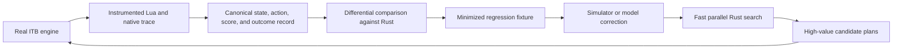

# ITB Engine Observatory: Looking Inside the Black Box

## Executive conclusion

Looking inside the real Into the Breach implementation is probably the
highest-leverage direction available for improving solver fidelity.

The important discovery is that ITB is not one sealed black box. The installed
game contains a large readable Lua specification surrounding a much smaller
native engine. The Lua already exposes weapon effects, targeting areas, spawn
selection, mission logic, and much of enemy target scoring. Targeted analysis
of one pinned Windows executable has now also mapped its RNG implementation,
enemy candidate tournament, native equal-best tie-break, and selected AI record.
The remaining unknowns are narrower and more valuable: native path and movement
enumeration details, complete RNG caller attribution and consumption order,
downstream action-queue and turn orchestration, effect execution, and hidden
engine state.

The strategic ordering should therefore be:

1. Improve model fidelity by reading and instrumenting the real game.
2. Convert every discovery into Rust conformance tests and regression fixtures.
3. Use the real game as a slow authoritative oracle.
4. Use the Rust simulator as the fast search engine.
5. Scale trusted experiments and rollouts across cores, processes, and VMs.

Parallelizing an inaccurate simulator generates confident mistakes faster.
Improving fidelity first makes every later rollout and every VM worker more
valuable.

## Build and content evidence

### Modified local Windows installation

The locally installed Steam build was inspected read-only on 2026-07-16 and
inventoried deterministically on 2026-07-23. This is a **modified installation**:
its `scripts/` tree contains the bridge `modloader.lua` and backup artifacts. It
must not be treated as a vanilla-depot file count.

The local `scripts/` tree contained 153 `.lua` files; `maps/` contained 376
`.map` files plus `maphelper.lua`. The complete byte-level Observatory snapshot
records 305 regular files under `scripts/**` and 377 under `maps/**`, plus:

- A 5,530,112-byte `Breach.exe`.
- A separate `lua5.1.dll`.
- Separate SDL2, FMOD, Steam, and Visual C++ runtime libraries.

The snapshot is
`data/observatory/inventories/windows_build_13725832_31fe35265598_local_modified.json`.
It contains normalized relative paths, per-file SHA-256 values, aggregate
scripts/maps revisions, and no absolute user path.

The executable is 32-bit x86 and imports the Lua 5.1 C API directly, including
functions such as `lua_pushcclosure`, `lua_setfield`, `lua_pcall`, and
`luaL_loadfile`. Readable strings in the executable include:

- `random_int`
- `random_bool`
- `seed`
- `aiSeed`
- `death_seed`
- `ScorePositioning`
- `GetTargetScore`

This Windows PE's debug directory retains the original PDB build path:

```text
D:\bigbrother\Kaiju\bin\Breach.pdb
```

The PDB itself is not installed, so a decompiler will not magically recover
the original source names. The embedded path is evidence about this Windows PE
only. It is not evidence about the macOS or Linux binaries.

The executable inspected during this snapshot had SHA-256:

```text
31FE352655982398FB3EE8B0BBE80EFD5D65E3A9AA11E3DC39D0364354493FE9
```

### Public vanilla-depot comparison

The public Steam depot listings were checked on 2026-07-23:

| Build platform | Depot | Build / manifest | Public content counts | Native shape |
|---|---:|---|---|---|
| Windows | [590381](https://steamdb.info/depot/590381/) | build `13725832`; manifest `8335438558621014449` | 154 Lua, 376 maps | `Breach.exe`, six DLLs including `lua5.1.dll` |
| macOS | [590382](https://steamdb.info/depot/590382/) | build `13725832`; manifest `2336337887533649473` | 152 Lua, 376 maps | app-bundle Mach-O plus frameworks/dylibs |
| Linux | [590383](https://steamdb.info/depot/590383/) | build `21601364`; manifest `8584573075182422035` | 152 Lua, 376 maps | `Breach` plus `linux_x64/*.so*` |

The Windows vanilla count includes the shipped zero-byte
`scripts/modloader.lua`; the local modified installation instead has a
non-empty bridge and backups. Counts and matching sizes are only clues. Public
file hashes require authentication, so shared Lua equality must be established
with inventories from clean local depots before it is claimed.

The depot listings demonstrate both the useful common layer and the native
boundary: the platforms expose the same broad Lua/map mechanics tree while
shipping different executables and libraries. They also demonstrate current
version drift: Linux is on build `21601364`, while the public Windows and macOS
depots remain on `13725832`.

The official macOS depot listing does **not** contain `itb_test.dylib`. The
tracked local `src/native/itb_test.dylib` is therefore a locally observed
artifact of unproven origin, not evidence that this library ships as a core
part of the macOS game.

Any native offset, hook, RNG conclusion, or Ghidra project must be keyed by the
full identity tuple: platform, executable format and architecture, build and
depot manifest, executable/native-library hashes, and scripts/maps content
revisions. Native behavior must not be transferred between Windows, macOS, and
Linux merely because surrounding Lua filenames match.

## What is already open in Lua

The shipped Lua is already an executable game specification for a surprisingly
large portion of the mechanics.

### Spawn selection

`scripts/spawner_backend.lua` contains `Spawner:NextPawn`, including:

- Weak-versus-strong selection ratios.
- Alpha upgrade ratios and streak breaking.
- Per-type maximum counts.
- Difficulty-dependent starting-spawn behavior.
- Living-upgrade caps.
- Leader/boss promotion.
- Pawn count tracking.
- Calls to `random_int`, `random_bool`, and `random_element` at the exact
  semantic decision points.

`scripts/spawner.lua` contains the difficulty- and island-specific spawner
parameters.

The spawn algorithm is therefore not fundamentally unknown. For the exact
inventoried Windows executable, the shared RNG algorithm and state transition
are now mapped. The unresolved pieces are spawn-specific caller attribution,
the complete call order leading into these Lua decisions, the state needed for
replay, and equivalence on other platform builds.

### Enemy targeting

`scripts/global.lua` contains the default implementations of:

- `Skill:GetTargetArea`
- `Skill:GetTargetScore`
- `Skill:ScoreList`
- `ScorePositioning`

The scoring code explicitly handles queued and instant effects, friendly
damage, buildings, enemies, pods, movement position, smoke, fire, water,
spawning tiles, and custom pawn position scores. Enemy-specific weapon scripts
override `GetTargetScore` where they require custom behavior.

This means the visible target-scoring formula is already available. On the
pinned Windows build, the target-vector loop, score calls, equal-best retention,
and native random tie-break are now mapped. Movement/path enumeration details,
native position helpers, runtime subclass coverage, higher-level record
selection, and the downstream queue handoff remain to be validated.

### Weapons, missions, and environments

The Lua tree also contains:

- Player and enemy `GetSkillEffect` implementations.
- Target-area and two-click targeting logic.
- Advanced Edition weapons and enemies.
- Boss-specific behaviors.
- Mission-specific objectives and scripted units.
- Environment selection and effects.
- Island, drop, event, and campaign-generation rules.

The modding community explicitly recommends searching the shipped scripts,
probing native function signatures through the Lua console, and logging runtime
values to learn how ITB behaves:

- [How to learn - How to mod ITB](https://www.subsetgames.com/forum/viewtopic.php?f=26&t=35229)
- [ITB Mod Loader](https://github.com/itb-community/ITB-ModLoader)
- [Mostly complete public-function inventory extracted from the binary](https://gist.github.com/KnightMiner/2f308a3747461748d6a2186d823e3424)

## Why this matters to the current solver

Two current limitations line up directly with the remaining native unknowns.

### Enemy projection

Historical local experiments described the depth-2 projection as agreeing with
real enemy targeting only about one-third of the time. That figure is a dated
diagnostic, not a current benchmark: it was not pinned to the present solver,
corpus, and engine identity. A build-keyed candidate/score trace can replace
the broad approximation with a mostly exact algorithm and make future accuracy
claims reproducible.

### Spawn replay

In two noisy seed-replay cases, manual inspection of simple Park-Miller
candidate streams found no obvious alignment with the new-unit diffs. No spawn
pool mapping or formal call-order fit was performed, so the experiment did not
establish whether `master_seed` and `ai_seed` are sufficient. Those recordings
also lack build identity, so the now-mapped Windows MSVC-style RNG cannot be
applied to them retroactively. Complete caller attribution and hidden call order
remain the central blockers; runtime RNG tracing attacks them directly.

Related local research:

- [`docs/seed_replay_experiment.md`](seed_replay_experiment.md)
- [`docs/seed_replay_hypotheses.md`](seed_replay_hypotheses.md)
- [`docs/parallel_universe_self_learning_research.md`](parallel_universe_self_learning_research.md)
- [`docs/itb_native_anchor_research.md`](itb_native_anchor_research.md)
- [`docs/observatory_provenance_audit.md`](observatory_provenance_audit.md)
- [`docs/observatory_player_weapon_id_index.md`](observatory_player_weapon_id_index.md)

## Recommended inside-out research ladder

| Layer | Method | Expected value | Difficulty |
|---|---|---:|---:|
| Shipped Lua | Index mechanics and map them to Rust | Extremely high | Low |
| Lua instrumentation | Log scores, candidates, effects, and RNG calls | Extremely high | Low-medium |
| Memory/API extension | Expose hidden board, pawn, and phase fields | High | Medium |
| Targeted native analysis | Analyze only unresolved native functions | High | Medium-high |
| Full engine reconstruction | Recreate the entire executable | Low ROI | Very high |

The goal is not to reconstruct rendering, audio, UI, or the entire campaign
engine. The solver needs an exact transition model, an accurate adversary model,
and well-calibrated uncertainty about future events.

## Phase 1: Treat Lua as an executable specification

Create a mechanics provenance index with entries such as:

```text
ITB Lua function
    -> corresponding Rust implementation
    -> focused conformance tests
    -> known differences or unsupported cases
    -> evidence source and engine build
```

Initial high-value mappings should include:

- Every player and enemy `GetSkillEffect`.
- Every `GetTargetArea` and `GetSecondTargetArea`.
- Every custom `GetTargetScore`.
- `Skill:ScoreList` and `ScorePositioning`.
- `Spawner:NextPawn` and `Spawner:SelectPawn`.
- Mission environment and turn-order callbacks.
- Advanced Edition overrides.

This index prevents mechanics knowledge from remaining scattered across code,
failure records, and prose. It also makes engine-version drift auditable.

## Phase 2: Instrument enemy decision-making

Wrap or temporarily override the Lua decision boundary:

- `Skill:GetTargetScore`
- `Skill:ScoreList`
- `ScorePositioning`
- Enemy-specific `GetTargetScore`
- `GetTargetArea`
- `GetSkillEffect`

For each enemy turn, capture:

```text
enemy identity and state
candidate origin and movement destination
candidate target
generated SkillEffect
instant and queued effects
position score
target score
candidate evaluation order
final selected movement and target
```

This changes the inference problem dramatically. Instead of seeing only the
winning action and guessing why it won, the observatory sees the tournament of
candidates that produced it.

With symmetrical synthetic boards, the remaining unexplained behavior should
reveal:

- Enumeration order.
- Stable versus random tie-breaking.
- Path preference.
- Whether movement and targeting are optimized jointly or sequentially.
- Special-case priority targets.
- Which native helper values affect `ScorePositioning`.

## Phase 3: Trace gameplay RNG

The dormant controller in `src/bridge/observatory_controller.lua` provides the
first controlled experiment: install exactly one return-preserving wrapper on
either `_G.random_int` or `_G.random_bool`. Tracing must be opt-in, bounded, and
restricted to a disposable experiment so normal achievement play is not
flooded with logs or perturbed by trace collection. Its schema-compatible
`call_site` value identifies the configured global, not the higher-level Lua
caller.

The offline Windows boundary map proves that native enemy selection also calls
the shared RNG core directly. A global wrapper is therefore useful but
incomplete by design; it cannot establish the complete stream or observe the
mapped native equal-best tie-break.

Questions the staged Lua-then-native trace program can answer include:

- What is the exact Lua-visible subset and complete native output order?
- Which calls resolve through the selected Lua global?
- What is the exact interleaving of native enemy calls and Lua spawn calls?
- How does the saved `aiSeed` relate to the next observed result?
- When is the shared stream reseeded between planning and spawning?
- Which state must be cloned for deterministic forks?

After proving that the global wrapper is neutral, a separate experiment can move to
the shared native RNG core and classify bounded return-address IDs. Such a core
observer needs its own ABI and enabled/disabled proof; safety does not transfer
from the Lua wrapper.

## Phase 4: Investigate a native Lua-call tracer

`Breach.exe` imports Lua 5.1 directly. Offline analysis of the pinned Windows
build has recovered the relevant Luabind route. The registration builder at RVA
`0x0004ac40` constructs descriptors for both overloads of each RNG name. Its
closure builder calls imported `lua_pushcclosure`, and its name writer publishes
the closure with `lua_settable`.

The resulting build-keyed map is:

```text
random_int(max)    -> RVA 0x000e0c20
random_int(lo, hi) -> RVA 0x000e0c40
random_bool(n)     -> RVA 0x000e0cb0
random_bool(a, b)  -> RVA 0x000e0cd0
```

This disproves the earlier random-specific `lua_setfield` hypothesis. The full
reviewed map and exact identity are in `docs/itb_native_anchor_research.md` and
`data/observatory/native/windows_build_13725832_31fe35265598_pe_boundaries.json`.

Selected native Lua functions might be observable through a carefully validated
trampoline that records Lua stack arguments and results before and after
invoking the original function. This remains a research design, not an
established capability. The four binding leaves are also incomplete for total
RNG coverage because native AI code calls the shared core directly. Any
trampoline can change calling or timing behavior and must be validated against
the exact binary before its evidence is trusted.

- `random_int`
- `random_bool`
- Board reachability and pathfinding helpers.
- Damage and effect application.
- Pawn target and queued-action accessors.
- Turn-phase helpers.
- Serialization-related functions.

This boundary-first approach gives static analysis named anchors and avoids
blind exploration of the executable.

## Phase 5: Reuse community memory research

The community has already built the open-source
[`memedit`](https://github.com/itb-community/memedit) extension. It exposes
otherwise hidden state and includes scanners that empirically calibrate memory
offsets by constructing controlled situations and searching for corresponding
changes.

Recent Mod Loader releases mention version-address updates and additional
accessors such as `Board:GetAttackOrder`:

- [ITB Mod Loader releases](https://github.com/itb-community/ITB-ModLoader/releases)

This suggests an active memory-discovery program rather than manual offset
guessing. Change one controlled property, scan for matching values, repeat, and
verify by reading or safely changing the isolated field.

Potential targets include:

- Full RNG state.
- Attack-order phase.
- Enemy action and queue state.
- Movement-spent and undo fields.
- Internal board flags.
- Hidden spawn state.
- Building health and special tile metadata.
- Serialization structures.

The current local installation contains a custom bridge-oriented
`modloader.lua`, not a complete installed copy of the current Mod Loader
extension tree. Community code should therefore be studied and selectively
integrated rather than blindly installed over the bridge.

## Phase 6: Targeted Ghidra analysis — offline tranche complete

The focused pass is complete for the exact Windows executable with SHA-256
`31fe352655982398fb3ee8b0bbe80efd5d65e3a9aa11e3dc39d0364354493fe9`.
Ghidra review plus the PE byte/call verifier now map and pin:

- all four RNG binding leaves and their actual Luabind registration route;
- the shared MSVC CRT RNG state transition and seed setter;
- `aiSeed` load, seeding, advance, store, and archive paths;
- the enemy target-vector tournament, `ScorePositioning`, `GetTargetScore`, and
  direct equal-best RNG call;
- dynamic `GetTargetArea` and `GetSkillEffect` callback paths; and
- the final 24-byte selected AI record copied into `aiDest` / `aiTarget` state.

The durable artifact contains reviewed region hashes and call edges decoded at
instruction boundaries relative to the declared starts, rather than executable
bytes or decompiled source. Run `scripts/itb_pe_boundary_map.py` against the
exact executable and inventory to revalidate it. Function-entry selection and
reachability remain reviewed analyst evidence, not independently discovered
verifier facts.

The remaining native priorities are now narrower:

1. Correlate the selected AI record with the downstream Pawn action queue.
2. Attribute shared-RNG callers, especially spawn selection, in exact order.
3. Resolve native pathfinding and reachability details needed by mismatches.
4. Resolve turn-phase ordering, queued effect execution, and hidden state.
5. Validate every behavior used by Rust with controlled matched captures.

Full executable reconstruction would spend enormous effort on systems irrelevant
to tactical solving. Targeted analysis keeps the work aligned with solver IQ.

## The Engine Observatory architecture

The desired learning pipeline is:


```mermaid
flowchart LR
    A["Real ITB engine"] --> B["Instrumented Lua and native trace"]
    B --> C["Canonical state, action, score, and outcome record"]
    C --> D["Differential comparison against Rust"]
    D --> E["Minimized regression fixture"]
    E --> F["Simulator or model correction"]
    F --> G["Fast parallel Rust search"]
    G --> H["High-value candidate plans"]
    H --> A
```

ITB becomes the slow authoritative oracle. Rust remains the fast world model
used for millions of counterfactuals.

The original executable should not sit inside every solver node. That would be
slow, fragile, difficult to parallelize, and hard to inspect. Its best role is
to teach and validate the independent simulator.

## Automated mechanic laboratories

The observatory should generate tiny synthetic scenarios designed to isolate
one rule at a time:

- One attacker, one target, and one obstruction.
- Every armor, ACID, shield, frozen, fire, smoke, and boost combination.
- Every push destination and collision type.
- Every water, chasm, lava, ice, mountain, and building interaction.
- Symmetrical boards for enemy tie-breaking.
- Carefully controlled RNG call counts.
- Rotated and reflected versions of the same state.
- Mission-specific units separated from unrelated mission machinery.

Each laboratory case runs through both ITB and Rust. The comparison should
capture the full intermediate transition where possible, not only the final
board.

### Metamorphic testing

Some correctness properties do not require knowing the exact expected output:

- Rotating a board and action should rotate the outcome.
- Reflecting a symmetrical scenario should reflect equivalent candidates.
- Adding an irrelevant distant unit should not change a local deterministic
  weapon effect.
- Repeating a deterministic scenario from an identical full state should
  produce an identical trace.

Violations can identify hidden dependencies, enumeration-order effects, or
missing state.

### Active learning

The test scheduler should choose the next experiment where information value is
highest:

- ITB and Rust disagree.
- Two plausible mechanic models disagree.
- The solver reports high uncertainty.
- A rule has weak or missing regression coverage.
- A real failure clusters around the same transition.
- A planned action is sensitive to enemy retargeting or spawn identity.

This turns reverse engineering into an iterative experimental science loop
rather than an open-ended decompilation project.

## Relationship to parallel VMs

VMs remain useful, but reverse engineering clarifies their best role.

Parallel ITB workers can:

- Run independent oracle experiments.
- Gather enemy candidate and score traces.
- Execute synthetic mechanic laboratories.
- Validate top-K Rust plans.
- Generate independent rollouts from checkpoints.
- Confirm determinism across cloned instances.
- Collect large training corpora for genuinely irreducible uncertainty.

For comparable oracle results, standardize workers on one exact build. Today
the practical default is the Windows build, either on Windows or under
Wine/Proton: it matches the community Mod Loader's native support and avoids
pooling results from the newer Linux executable with the older Windows/macOS
builds. Every result bundle must still include the build/content identity.
Native Linux workers are a separate experimental cohort, not interchangeable
replicas.

Longer term, sufficient knowledge of serialization and RNG state may allow
lighter-weight cloning than whole-VM checkpoints. A canonical scenario could be
injected into several workers, with each worker applying a different candidate
action. VM cloning remains the reliable fallback when the full hidden state is
not yet understood.

The scaling hierarchy should be:

1. Parallel Rust evaluation for ordinary search.
2. Multiple ITB processes or compatibility-prefix workers for oracle sampling.
3. VMs for isolation, reproducible checkpoints, and exact process-state forks.
4. Additional physical machines only after experiments saturate the current
   hardware.

## Recommended first project: ITB Engine Observatory v0

### Milestone 1: Provenance inventory

- Hash and identify the installed game build.
- Index high-value Lua mechanics.
- Map them to current Rust coverage.
- Record exact gaps and ambiguous native dependencies.

### Milestone 2: Enemy decision trace

- Add an opt-in trace mode.
- Capture every target and position score considered during controlled enemy
  turns.
- Compare final engine choices with the current Rust enemy model.
- Construct symmetrical boards to isolate tie-breaking.

### Milestone 3: RNG trace

- Wrap `random_int` and `random_bool` during controlled experiments.
- Record call order, bounds, results, phase, and caller evidence.
- Compare outputs with captured `aiSeed` transitions.
- Determine whether Lua tracing observes all relevant randomness.

### Milestone 4: Hidden-state survey

- Study `memedit` without overwriting the existing bridge.
- Inventory useful existing accessors and scanners.
- Prototype read-only extraction of attack order and other high-value fields.
- Identify whether PRNG state can be located empirically.

### Milestone 5: Targeted native map

- **Offline Windows tranche complete:** named RNG bindings, the shared RNG,
  enemy candidate/score callbacks, tie-breaking, and the selected record are
  build-keyed and independently verifiable.
- Keep pathfinding and serialization analysis mismatch-driven rather than
  attempting broad reconstruction.
- Validate the mapped interpretations and hook neutrality dynamically before
  promoting trace-derived behavior into Rust.

### Milestone 6: Differential lab

- Generate synthetic board/action cases.
- Run each case through ITB and Rust.
- Minimize mismatches into regression fixtures.
- Feed verified fixes through existing simulator-version discipline.

## Measures of success

The observatory should be judged by solver improvements rather than the amount
of engine code examined.

Useful metrics include:

- Enemy target top-1 and top-K prediction accuracy.
- Enemy movement-destination accuracy.
- Spawn-type and upgrade-distribution calibration.
- Exact replay rate from captured state.
- Rust-versus-engine transition agreement.
- Number of unknown mechanic families remaining.
- Failure recurrence after a verified regression is added.
- Planning improvements from better depth-2 projections.
- Oracle experiments required per resolved uncertainty.

## Final recommendation

The targeted offline map is now deep enough; do not broaden into full
decompilation. The next concrete experiment should use a disposable,
non-achievement installation and add one reviewed observation family at a time.
Start with one global RNG wrapper, prove enabled/disabled equivalence, then move
to bounded native caller attribution, candidate scores, and correlation of the
selected record with the final queued action.

Once those traces improve the Rust world model, parallel VMs become a powerful
force multiplier instead of a way to scale uncertainty.
