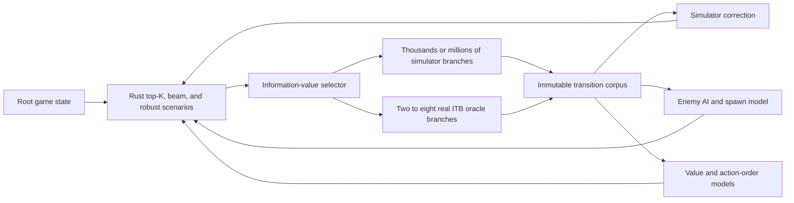

# Parallel-Universes Self-Learning Research

**Date:** 2026-07-15

**Status:** Architecture brainstorm and feasibility research

**Thesis:** Use the Rust simulator to explore millions of cheap universes and a
small number of real Into the Breach instances as ground-truth oracles for the
most informative forks.

## Executive Summary

Parallel game instances and exact-state forks are technically feasible and can
materially improve the solver. The best design is not one VM for every legal
move. It is a hybrid counterfactual engine:

1. The Rust simulator performs nearly all search, replay, fuzzing, and tuning.
2. Lightweight isolated game workers run independent campaigns and controlled
   mechanic experiments.
3. Memory-snapshot-capable VMs are reserved for exact, high-value
   counterfactual forks.
4. A coordinator selects experiments by expected information value and stores
   immutable actual transitions.

The compounding flywheel is:

> uncertainty -> targeted real-engine experiment -> immutable transition ->
> simulator/search/value improvement -> better experiment selection

This produces more solver intelligence per CPU-hour than blindly multiplying
full game runs.

## How Far the Self-Learning Loop Can Go

The current project is already close to a research platform. It has:

- Per-action prediction verification and structured desync records.
- Unknown-behavior detection, research queues, soft-disabling, and runtime
  weapon overrides.
- Rule-based and agent-assisted diagnosis with human-reviewed fixes.
- Replay, top-K search, depth-2 beam search, robust scenario diagnostics, and
  weight tuning.
- A substantial corpus. At the time of this research, the local workspace held
  about 4,086 solve recordings, 4,889 board recordings, 5,258 failure rows,
  and 2.3 GB of recordings.

The next bottleneck is no longer merely collecting more data. It is obtaining
better causal data, maintaining corpus integrity across simulator revisions,
and preventing training and evaluation leakage.

Two important limitations are:

1. Alternate decisions are normally evaluated with simulator-predicted
   outcomes rather than outcomes observed in the real engine. The tuner can
   therefore learn the simulator's own errors.
2. Training and validation substantially reuse the same recorded corpus.
   States from one run, and especially sibling branches from one fork, must not
   be split across training and validation sets.

Exact forks supply the missing causal label:

> Starting from the same hidden game state, what actually happens when the bot
> chooses plan A rather than plan B?

The most valuable learning consumers would be:

- A simulator residual/uncertainty model that predicts the probability and
  type of a simulation miss.
- A learned enemy movement and targeting model. Historical local experiments
  reported about one-third agreement for depth-2 projection, but that dated
  figure was not pinned to the current solver, corpus, and engine identity.
- A spawn-distribution model. Robust planning over plausible spawns may be
  more practical than reproducing the private RNG exactly.
- An action-ordering prior distilled from deeper search, used to accelerate
  exhaustive search rather than replace it.
- A pairwise value model trained from actual A-vs-B engine forks.
- Contextual bandits for islands, missions, shops, squads, pilots, and
  upgrades.
- Automated mechanic experiments and patch drafts, with human review retained
  before promotion.

Hard tactical priorities must remain lexicographic. Learned values may rank
plans within the safest tier, but must never learn that an avoidable building
or grid hit is worthwhile merely because it produces more kills.

## Can an Exact Universe Be Cloned?

Yes, provided the game is already running inside the VM. There are three
different fidelity levels:

| Fork method | Preserved state | Expected fidelity |
|---|---|---|
| Copy `saveData.lua` and `undoSave.lua` | Persisted game state | Promising only at clean turn boundaries |
| Powered-off VM clone | Disk, OS, and files | Same save, but game process and hidden RNG are recreated |
| Live memory checkpoint | CPU, RAM, devices, disks, process state, hidden RNG | Best candidate for an exact universe |

The repository's existing snapshot command is not an exact engine capsule. It
copies saves and session information, not the running process's memory. In two
noisy seed-replay cases, simple candidate streams showed no obvious manual
alignment with observed new-unit diffs. No pool mapping or formal call-order
fit was performed, so the experiment did not establish whether captured master
and AI seeds are sufficient. Engine-private RNG behavior and call order remain
unknown.

A live VM checkpoint preserves much more of the required state:

- Hyper-V **Standard** checkpoints capture VM memory. Production checkpoints
  do not. Microsoft describes applying a Standard checkpoint as returning the
  system to its exact prior state. See [Microsoft's checkpoint
  documentation](https://learn.microsoft.com/en-us/windows-server/virtualization/hyper-v/checkpoints).
- VirtualBox running snapshots preserve memory and use copy-on-write
  differencing disks. See the [Oracle VirtualBox user
  guide](https://docs.oracle.com/en/virtualization/virtualbox/7.2/user/Introduction.html).
- QEMU VM snapshots include CPU, RAM, device state, and writable disks. See
  [QEMU VM snapshot
  documentation](https://www.qemu.org/docs/master/system/images.html).
- On a future bare-metal Linux host, Firecracker can restore lightweight
  microVMs from memory snapshots using copy-on-write mappings. See the
  [Firecracker snapshot
  design](https://github.com/firecracker-microvm/firecracker/blob/main/docs/snapshotting/snapshot-support.md).

Exactness must be proven rather than assumed. Wall clocks, OS entropy,
renderer/device state, asynchronous callbacks, and external bridge files can
still introduce divergence.

### Fork-Fidelity Qualification

1. Pause at a fresh player-turn boundary before any actor moves.
2. Take a RAM-bearing snapshot.
3. Restore 5-10 replicas.
4. Send every replica the identical action sequence.
5. Canonicalize and hash bridge state after every move, attack, enemy phase,
   spawn, and turn transition.
6. Compare seeds, units, tiles, objectives, logs, and save files.
7. Repeat across multiple missions and mechanics.
8. Only after identical-input replicas remain identical should different first
   actions be treated as valid counterfactual branches.

If twins diverge under identical inputs, instrument `random_int` and
`random_bool`, remove clocks and network activity where possible, or restrict
the supported fork boundary.

A lighter save-only fork should also be tested at a verified, all-actors-active
player-turn boundary and after a clean Save and Quit. It may be useful for many
independent workers even if it cannot reproduce arbitrary mid-turn state.

## Why VMs Should Not Enumerate Every Legal Plan

The number of universes grows exponentially. Rust already enumerates
current-turn plans using Rayon and exposes top-K and depth-2 beam search.



Real forks should be reserved for decisions with high:

`policy disagreement * consequence * model uncertainty * recurrence / rollout cost`

Good fork candidates include:

- Two clean plans with nearly equal scores.
- Depth-1 and depth-2 disagreement.
- A plan that depends on an incompletely modeled weapon, pawn, terrain, or
  mission mechanic.
- A dirty plan whose next-turn recoverability is uncertain.
- A decision dominated by enemy retargeting or unknown spawn identity.
- A result that would confirm or retire a recurring simulator hypothesis.

This is a path for eventually promoting today's diagnostic robust frontier into
live selection backed by actual-engine evidence instead of only heuristic
future boards.

## Recommended Worker Architecture

### Tier 1: Host-Side Simulator Farm

Run replay, top-K search, property fuzzing, tuning, and regression directly in
Rust. This produces vastly more rollouts per CPU-hour than running the complete
game.

Rust already uses Rayon internally, so concurrency must be budgeted explicitly.
For example, use `RAYON_NUM_THREADS=1` for each concurrent process or create one
centralized worker pool. Otherwise several workers may each attempt to consume
all logical CPUs and reduce total throughput.

### Tier 2: Lightweight Independent Game Workers

For ordinary campaigns, map coverage, and mechanic experiments, full VMs are
unnecessary. Use isolated Wine prefixes or containers with:

- A unique `HOME` and `WINEPREFIX`.
- Unique `ITB_SAVE_DIR` and `ITB_BRIDGE_DIR` values, which the bridge already
  supports.
- Unique session, log, snapshot, recording, and failure-output roots.
- One virtual display per worker.
- A host-only control channel.
- Immutable result uploads to one coordinator/ingester.

The current code still hardcodes `sessions/active_session.json` and several
artifact locations. Before parallel play, introduce configuration such as:

- `ITB_INSTANCE_ID`
- `ITB_SESSION_FILE`
- `ITB_ARTIFACT_ROOT`

Workers must never append directly to the same JSONL file or share one live
profile. Each worker should produce a sealed result bundle, and a single
ingester should update canonical datasets.

### Tier 3: Snapshot-Capable VM Workers

Use full or micro VMs only for true in-memory counterfactual forks. Their
higher overhead is acceptable because the coordinator should select only a
small number of high-information branches.

Each result bundle should include:

- Experiment, worker, root-state, and parent-snapshot identifiers.
- Build platform, executable format/architecture, Steam build/depot evidence,
  executable/native-library hashes, and normalized scripts/maps revisions.
- Modloader and bridge hashes.
- Solver commit, simulator version, and weight profile.
- Master and AI seeds.
- Initial canonical state hash.
- Forced action prefix and requested horizon.
- Every actual transition and state hash.
- Terminal metrics and resulting state hash.

## Corpus and Evaluation Redesign

The source of truth should be an immutable transition corpus rather than a
simulator-version-specific failure database. Store records like:

```text
state_before + action + actual_state_after + phase + engine metadata
```

Predictions, diffs, diagnoses, and failure categories should be regenerable
derived views keyed by simulator version. After a simulator change, replay the
raw observation corpus and recompute the derived data instead of treating old
actual observations as stale.

Dataset splitting should occur by root state, master seed, and run. Every
sibling from one fork must stay in the same train, validation, or test group.
A candidate model should pass:

1. Training-corpus checks.
2. A grouped, untouched holdout.
3. Shadow evaluation on recent live states.
4. Independent campaign canaries.
5. The existing lexicographic safety and regression gates.

## Headless Ubuntu Feasibility

Into the Breach officially supports Linux and has a very small published
minimum: 1.7 GHz CPU, 1 GB RAM, OpenGL 2.1, and about 400 MB storage. See the
[official Steam system
requirements](https://store.steampowered.com/app/590380/Into_the_Breach/).

The bridge has an important compatibility wrinkle: the community ModLoader
currently documents native modding as Windows-only and recommends running the
Windows game build through Wine or Proton on Linux. See the [ITB ModLoader
installation
guide](https://github-wiki-see.page/m/itb-community/ITB-ModLoader/wiki/Installing-Mods).

The practical headless stack is therefore:

- Ubuntu Server on KVM.
- The Windows ITB build under Wine or Proton.
- ITB ModLoader plus the Lua bridge.
- Xvfb virtual displays.
- Mesa LLVMpipe or virtual GPU rendering.
- One isolated prefix, display, profile, and bridge directory per worker.

This is also an experimental-control decision. As of the 2026-07-23 depot
inventory, the native Linux depot is on build `21601364`, while the public
Windows and macOS depots are on `13725832`. Standardizing oracle workers on the
exact Windows build—on Windows or under Wine/Proton—reduces native platform and
version variance and matches the Mod Loader's supported native path. A native
Linux worker is a separate cohort: never merge its RNG, offset, hook, or
tie-breaking evidence into Windows results merely because the Lua filenames
look the same.

A DRM-free offline build is operationally simpler for isolated research
workers. GOG offers an offline installer, requires no activation or Galaxy
client, and supports Windows, Linux, and macOS. See [Into the Breach on
GOG](https://www.gog.com/en/game/into_the_breach).

Containers or separate Wine prefixes are the best density choice for
independent runs. QEMU/KVM or Firecracker is the better substrate when exact
RAM-state forking is required. CRIU process-tree checkpointing is worth a later
experiment, but Wine, graphics sockets, file locks, and the display server make
it a riskier foundation.

## Feasibility on This Computer

The following hardware and concurrency figures are a dated inspection snapshot,
not a statement about every current worker host.

The inspected host has:

- Intel Core i7-6700K: 4 physical cores and 8 threads.
- 32 GB RAM, with about 21 GB available during inspection.
- NVIDIA GTX 1080 and GTX 1060 3 GB GPUs.
- A 256 GB NVMe drive, two 960 GB SATA SSDs, and a 5 TB HDD.
- VirtualBox 7.2.6.
- An existing Ubuntu VM named `ramen`, configured with 2 vCPUs and 8 GB RAM
  and stored on the HDD.
- A Microsoft hypervisor present on the host.

The CPU is the limiting resource.

| Workload | Practical concurrency on this host |
|---|---:|
| Heavy Rust searches | About four one-thread workers |
| Lightweight Wine/ITB workers | About three to four |
| Minimal Linux VMs | Two to three comfortably |
| Windows desktop VMs | One to two comfortably; benchmark three |

RAM can hold more guests, but four physical cores cannot advance many
CPU-active worlds efficiently. Hyperthreads help orchestration and I/O but are
not eight full solver cores.

Recommended pilot configuration:

- Start with two workers and benchmark total throughput at 1, 2, 3, and 4.
- Cap solver threads per worker.
- Put active images and copy-on-write overlays on the SATA SSD with roughly
  682 GB free, not the nearly full system NVMe or the HDD.
- Disable guest audio, recording, USB, clipboard, and unnecessary services.
- Use a fixed, low virtual resolution.
- Centralize solving on the host so game guests mostly execute assigned
  actions and return observations.

VirtualBox can coexist with Hyper-V, but Oracle warns that some hosts can see
significant performance degradation. See [Oracle's Hyper-V compatibility
note](https://docs.oracle.com/en/virtualization/virtualbox/6.0/admin/hyperv-support.html).
Use one primary hypervisor for the experiment instead of casually changing
host security configuration.

## GPU Requirements

A GPU is not required for the core workload:

- The Rust simulator is CPU-only.
- ITB requires only OpenGL 2.1 and Intel HD 3000-class graphics.
- VM snapshots and orchestration depend on CPU, RAM, and storage.
- LLVMpipe can render headlessly on the CPU.

A modest GPU or virtual 3D backend may reduce software-rendering CPU overhead,
but the two existing NVIDIA cards do not automatically become one GPU per VM.
GPU passthrough and partitioning add complexity without fixing the main CPU
bottleneck.

A large GPU becomes worthwhile only if the project later trains a substantial
neural policy or value model. Even then, data generation and tactical search
remain primarily CPU workloads.

## Hardware Recommendations

### Serious Dedicated Node

- Modern 16-core, 32-thread CPU.
- 128 GB RAM.
- 2-4 TB high-endurance TLC NVMe storage.
- Integrated graphics or an inexpensive discrete GPU.
- Bare-metal Ubuntu with KVM.

The Ryzen 9 9950X is an example: 16 cores, 32 threads, support for up to
256 GB RAM, and minimal integrated graphics. See [AMD's
specifications](https://www.amd.com/en/products/processors/desktops/ryzen/9000-series/amd-ryzen-9-9950x.html).

### Larger Farm

- A 32-64-core Threadripper or server CPU.
- 256-512 GB ECC RAM.
- Multiple NVMe drives or mirrored enterprise SSDs.
- Approximately 20-50 lightweight workers, subject to measured CPU and
  rendering cost.

Several inexpensive 12-16-core nodes may provide better resilience and value
than one enormous workstation. Worker tasks and result bundles are small enough
that ordinary Ethernet is sufficient.

## Recommended Roadmap

### Phase 0: Data Foundation

- Introduce immutable actual-transition records.
- Add content hashes and root-state identifiers.
- Make predictions and diffs regenerable per simulator version.
- Create root-grouped train, validation, and test splits.
- Build a corpus health/version dashboard.

### Phase 1: Offline Parallelism

- Batch replay, top-K search, tuning, and regression across the existing
  corpus.
- Enforce explicit Rayon and worker budgets.
- Add a genuine holdout and live canary gate.
- Do not promote weights solely from performance on their training corpus.

### Phase 2: Two Isolated Independent Workers

- Complete path namespacing.
- Add the coordinator and single result ingester.
- Run different squads, missions, and seeds for diversity.
- Measure turns per hour, failures per hour, RAM, CPU, and artifact volume.

### Phase 3: Fork-Fidelity Lab

- Snapshot a quiescent player-turn VM with RAM, devices, and disk.
- Run identical-plan replicas and hash every transition.
- Compare live-memory and save-only forks.
- Instrument RNG calls if identical-input replicas diverge.

### Phase 4: Selective Branch Service

- Generate top-K and beam candidates in Rust.
- Cluster candidates for tactical and outcome diversity.
- Select two to eight high-information plans.
- Execute one-enemy-phase forks first, then two- to three-turn horizons.
- Store actual pairwise outcomes.

### Phase 5: Learning Consumers

- Train residual/uncertainty, enemy-targeting, spawn-distribution,
  action-ordering, and pairwise-value models.
- Run all learned components in shadow mode initially.
- Use learned values only within the lexicographically safe plan tier.
- Promote only after grouped holdout and independent campaign canaries.

### Phase 6: Scale by Information per CPU-Hour

- Begin with an approximate 80% budget for diverse independent campaigns and
  20% for selective forks.
- Track useful novel transitions, resolved model gaps, search savings, and
  downstream win/safety improvements per CPU-hour.
- Increase VM capacity only while its marginal information yield exceeds
  broader simulator or campaign exploration.

## Additional Compounding Experiments

- **Common-random-number comparisons:** Fork the same hidden RNG state so
  plan differences have lower statistical noise.
- **Policy-disagreement queue:** Automatically fork states where old and new
  solvers, weight profiles, or search depths disagree.
- **Mechanic curriculum:** Generate controlled boards that isolate one weapon,
  pawn, status, terrain, or mission effect at a time.
- **Counterexample minimization:** After a desync, reduce the board to the
  smallest state/action combination that still reproduces it.
- **Adversarial state search:** Ask the simulator to find boards on which two
  versions disagree, then validate only those boards in the engine.
- **Uncertainty-calibrated search budgets:** Spend deeper search and oracle
  forks only when predicted confidence is low or consequences are irreversible.
- **Learned enemy-policy ensemble:** Preserve multiple plausible enemy intents
  and optimize for worst-case or risk-sensitive recovery rather than trusting
  one predicted target.
- **Campaign-level experimentation:** Use independent full runs for mission,
  shop, pilot, upgrade, and island strategy while tactical forks remain short
  and causal.
- **Canary universe pool:** Before deploying a simulator or policy change,
  replay a fixed set of qualified VM states and require exact safety parity.

## Conclusion

Parallel ITB instances are feasible, including exact-looking forks from VM
memory snapshots. The highest-value architecture is a Rust world model plus a
small real-engine oracle farm, not a brute-force VM tree.

The current computer is suitable for a two- to four-worker proof of concept.
A dedicated modern 16-core CPU, 128 GB RAM, and fast NVMe would be the natural
next step. GPU investment is unnecessary unless neural-model training becomes
a major component.

The defining design principle is to make every real game minute answer a
question the simulator cannot answer cheaply. That is what turns parallelism
into a compounding intelligence loop rather than just a faster collection of
similar games.
